## lecture 1 Introduction

### What is Flexbox?

CSS Flexible Box Module is a one dimensional layout model which makes it easy to build

- flexible and efficient layouts
- distribute space among items
- control their alignment

### Layout modes

Before flexbox there were 4 layout modes

1. `Block`, for sections in a webpage.
2. `inline`, for text
3. `Table`, for two dimensional table data
4. `Positioned`, for explicit position of an element

but these layout didnot provide enough flexibility

### Why Flexbox?

1. a lot of flexibility
2. arrange items
3. spacing
4. alignment
5. order of items
6. bootstrap 4 is built on top of the flex layout

## lecture 2 Terminology

### Two entities

When we talk about flexbox we mainly have 2 entities.

1. A parent container which we term as `Flex Container`
2. And the immediate children elements which we term as `Flex Items`

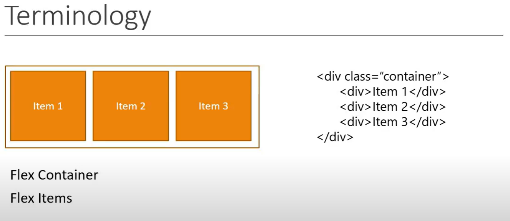

here the div with class container is `flex container` and the div with items are `flex items`

### Two axis

we have 2 axis in flexbox

1. `Main Axis` (by default runs horizantal from left to right)
2. `Cross Axis` (by default runs perpendicular from top to bottom)

- The starting point of the main axis is termed as `main start` and end point is `main end`.
- The length from `main start` and `main end` is `main size`.

So we can say that the flex items flow from `main start` till `main end` and take up the main size as the length.
Similar for the Cross axis `cross start` is at the top and `cross end` is at the bottom.

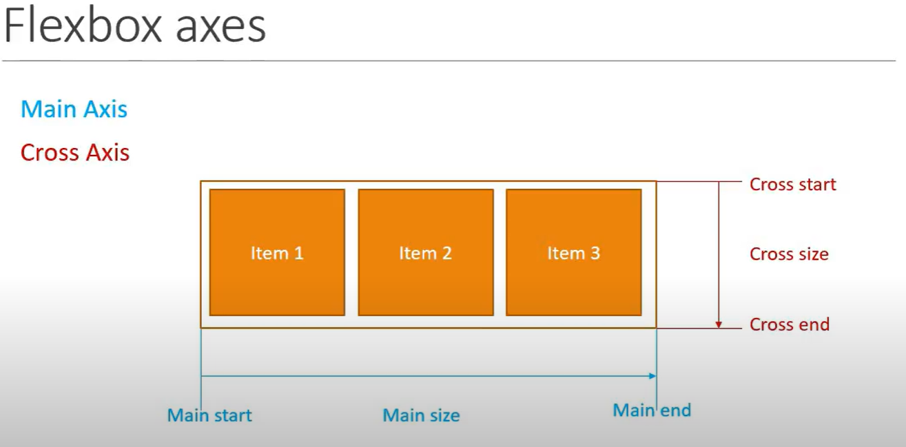

We can change the direction but we will talk about this later.

## lecture 3 Flex Container Properties

in this we will see all the properties related to `flex container`

1. `display` : This is what define a flex container and is `mandatory` to work with flex container
2. `flex-direction`: define the direction of flex items placed in a `flex container`.
3. `flex-wrap` : which is used to control the wrapping of items within a `flex container`.
4. `flex-flow`: a shorthand for the `flex-direction` and `flex-wrap`.
5. `justify-content`: it define the alignment of the items along the `main axis`
6. `align-items`: it defines how the `flex items` are laid along the `cross axis`
7. `align-content`: this is similar to `justify-content` the only difference is that it will do it along the `cross axis` instead of `main axis`. also `align-content` works only if we have multiple rows

## lecture 4 Flex display

1. create an html file `index.html`

```
<!DOCTYPE html>
<html lang="en">
<head>
  <meta charset="UTF-8">
  <meta http-equiv="X-UA-Compatible" content="IE=edge">
  <meta name="viewport" content="width=device-width, initial-scale=1.0">
  <title>Document</title>
  <link rel="stylesheet" href="styles.css">
</head>
<body>
  <div class="container">
    <div class="flex-item item-1">Item 1</div>
    <div class="flex-item item-2">Item 2</div>
    <div class="flex-item item-3">Item 3</div>
    <div class="flex-item item-4">Item 4</div>
    <div class="flex-item item-5">Item 5</div>
    <div class="flex-item item-6">Item 6</div>
    <div class="flex-item item-7">Item 7</div>
    <div class="flex-item item-8">Item 8</div>
    <div class="flex-item item-9">Item 9</div>
  </div>
</body>
</html>
```

2. create a `styles.css` file

```
body{
  margin: 0;
}
.container{
  border: 6px solid black
}
.flex-item{
  color: white;
  font-size: 1.5rem;
  padding: 1rem;
  text-align: center;

}
.item-1 {
  background-color: #B4BF35;
}
.item-2 {
  background-color: #B95F21;
}
.item-3 {
  background-color: #1C4C56;
}
.item-4 {
  background-color: #CfB276;
}
.item-5 {
  background-color: #6B0803;
}
.item-6 {
  background-color: #1C4C56;
}
.item-7 {
  background-color: #B95F21;
}
.item-8 {
  background-color: #01243A;
}
.item-9 {
  background-color: #AAD041;
}
```

The result will be like as under

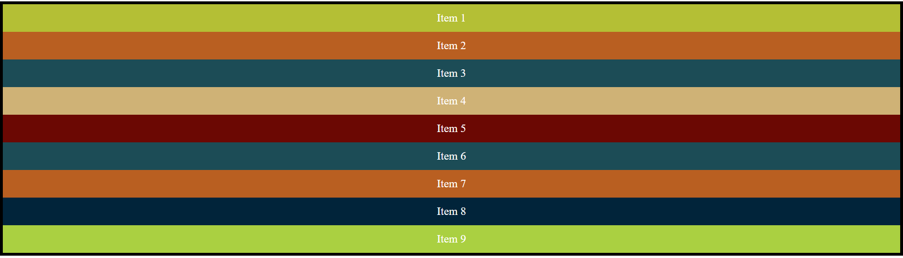

now when we apply the `display: flex` property on the `flex container`

```
.container{
  border: 6px solid black;
  display: flex;
}
```

The result is like so
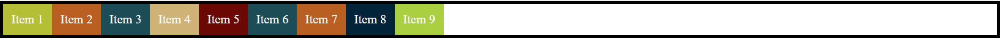

so if we see the `flex container` is taking the full block width and all the child items will take some space.

if we want the `flex container` not to take the block space only the `inline` space than we have to to specify as `display: flex-inline` and the result is as under.

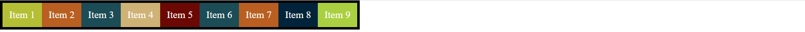

so to sum up `display` either creates either a block level or inline level flex container.

1. `display: flex`
2. `display: inline-flex`

## lecture 5 flex direction

It sets the direction of the `main axis`. we have 4 major types for it.

1. `flex-direction: row` the default
2. `flex-direction: row-reverse` main axis change from `left to right` to `right to left`
3. `flex-direction: column` main axis change to `top to bottom`
4. `flex-direction: column-reverse` main axis change to `bottom to top`

## lecture 6 Flex wrap

`flex-wrap` property is applied on the container. By default all the `flex-items` in a container will try to fit in a single line. if there is not enough space the items simply overflow. flex wrap has different scenarios it also depends on the `flex-direction`.

`flex-wrap` has the following options
`flex-wrap: nowrap` is the default
`flex-wrap: wrap`
`flex-wrap: wrap-reverse`

### when flex-direction: row

when `flex-direction: row` and the flex items are not fitting horizantally than.

1. if we apply `flex-wrap: wrap` the flex items wrapp and moved to the second row below
2. if we apply `flex-wrap: wrap-reverse` the flex items wrapp and moved to the row above

### when flex-direction: column

for this first we have to give a value of `height` to the `flex-container`. so when the height decreases the number of columns increases due to wrapping

1. if we apply `flex-wrap: wrap` the flex items wrapp and moved to the right column
2. if we apply `flex-wrap: wrap-reverse` the flex items wrapp and moved to the left column

### no-wrap

if we apply `flex-wrap: no-wrap` the items will not wrap even if we change height and width

## lecture 7 flex-flow

it is a shorthand for `flex-direction` and `flex-wrap`. by default we have
`flex-direction: row`
`flex-wrap: nowrap`

`flex-flow: <flex-direction><flex-wrap>`

for `flex-flow` we have to assign 2 values the first position will be for `flex-direction` and second position for `flex-wrap`. for example
`flex-flow: row-reverse wrap`.

you can give any combination of these 2. for example

```
  height: 200px;
  flex-flow: wrap column;
```

## lecture 8 Justify content

now take a look of the alignment properties provided by the `flex container`. `justify-content` will be the first alignment property.
To see the `justify-content` property more clearly we will reduce the number of items to 5.

- `justify-content` defines the alignment along the main axis.

by default the `justify-content` take the value of `flex-start` which places the `flex-items` at the begining of the `main axis` which is also know as `main start` so like this.

`justify-content: flex-start` -- default
`justify-content: flex-end` -- it will place the items at the end of the `main axis`
`justify-content: center` -- it will place the items at the center of the `main axis`
`justify-content: space-between` -- it will place the items with equal spaces between them on the `main axis`
`justify-content: space-around` -- it will place the items with equal spaces between them and half of the spaces at the start and at the end.
`justify-content: space-evenly` -- it will place the items with equal spaces between them and same spaces at the start and at the end.

`justify-content` works with the `main axis`. so if we change the `flex-direction` to `column` than all the above properties for alignment will work vertically. because now the `main axis` is vertical.

in short `justify-content` align items and distribute any extra spacing in the parent container.

## lecture 9 Align items

The next alignment property is `align-items`. `align-items` work with the `cross axis`. which means to say that `align-items` works similar as `justify-content` but along the `cross axis`.

To see the changes first we give a `height:700px` to the `flex container`

`align-item: stretch` is the default it will stretch the items vertically across the `cross axis` till the end of the `flex container`
`align-item: flex-end` -- it will place the items at the end of the `cross axis`
`align-item: flex-start` -- it will place the items at the start of the `cross axis`
`align-item: center` -- it will place the items at the center of the `cross axis`

`align-item: baseline` -- it will place the items at the baseline (example alphabets). for this we will change some of the `flex items` content to see the baseline

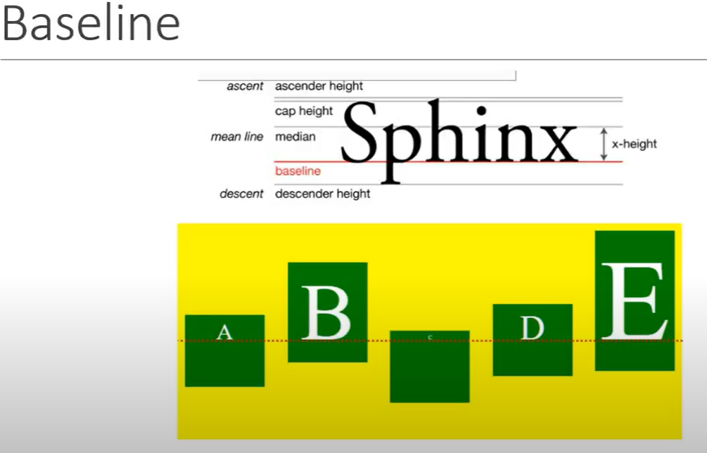

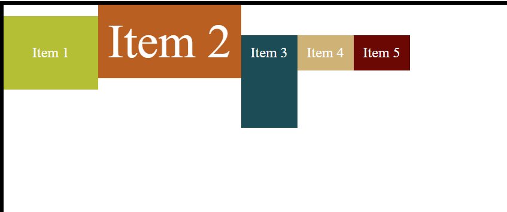

## lecture 10 align content

`align-content` works only when we apply `flex-wrap: wrap`. it means align content work with multiple lines or rows you can say along the `cross axis`

`align-content: stretch` is the default it will stretch the items vertically across the `cross axis` till the end of the `flex container`
`align-content: flex-end` -- it will place the items at the end of the `cross axis`
`align-content: flex-start` -- it will place the items at the start of the `cross axis`
`align-content: center` -- it will place the items at the center of the `cross axis`

`align-content: space-between` -- it will place the items with equal spaces between them on the `cross axis`
`align-content: space-around` -- it will place the items with equal spaces between them and half of the spaces at the start and at the end on `cross axis`.
`align-content: space-evenly` -- it will place the items with equal spaces between them and same spaces at the start and at the end on `cross axis`..

on short it aligns lines of content along the cross axis and distribute any extra spacing in the parent container.

## lecture 11 Flex item properties

until now we were working on the `flex container` properties. now we will discuss the `flex item` properties. These are

1. order
2. flex-grow
3. flex-shrink
4. flex-basis
5. flex --- shorthand for (flex-grow, flex-shrink, flex-basis)
6. align-self

## lecture 12 Order

`order` control the order of items in the flex container. it takes an integer value.

normally the items will show in the UI according to how it is present in the code. but we can change this order with the `order` property.
by default every item has `order` zero. but if we want any item to go the last we give a high integer for that item order.

for example to give an order of 1 to item 3 and order of 5 item 7. so item 7 will be the last and item 3 will be the second to last.

1[order](./pictures/order.PNG)

## lecture 13 Flex grow

Dictates what amount of the available space inside the flex container the item should take up.
Relative to the other items in the container.
Default value is 0 - items do not grow.
`flex-grow: 1` - flex items grow evenly.

if `flex-grow: 1` is applied to all the flex item in a container. all the item will divide the extra white space
if one item is `flex-grow: 1` and the second is `flex-grow: 3`. it means the second item will be 3 times bigger than the first one.
don't give a negative value to `flex-grow`
decimal values can also be accepted


## lecture 14 Flex Shrink

Dictates the shrink factor of the flex items when the default size of flex items is larger than the flex container.
Relative to the other items in the container.
Default value is 1.

so every item will shrink with a factor of 1 by default before overflowing. if we give `flex-shrink: 0` the items will not shrink and just overflow straight away.

if we give an item `flex-shrink: 4` it will shrink 4 times more than the other items in a container. we have to give some extra `width` to all the elements to see the
shrinking behaviour. we applied here a width of `8rem`. the results are

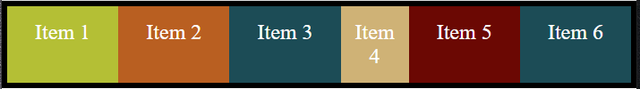

## lecture 15 Flex basis

As we use a `width` property in the previous lecture to demonstrate shrink. don't use that instead use `flex-basis`.

flex-basis set the initial size of a flex item.
we can use pixels,percentage or relative units.
default value of flex-basis is `auto`. `flex-basis: auto`

it means if a flex item has more content it will take more width of space you can say by default.

also if we apply some pixels to `flex-basis` the `flex-grow` and `flex-shrink` will work on that number of pixels than as a basis.

## lecture 16 flex

`flex` property is applied to `flex items`

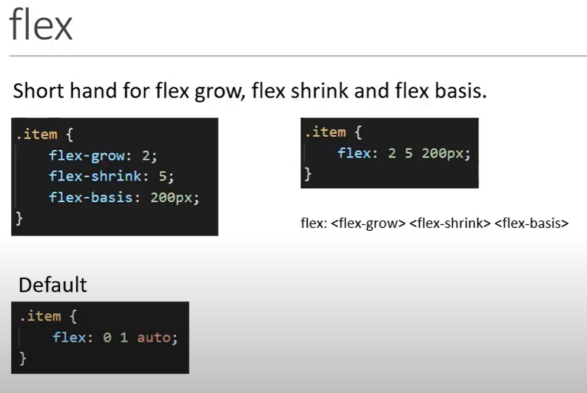

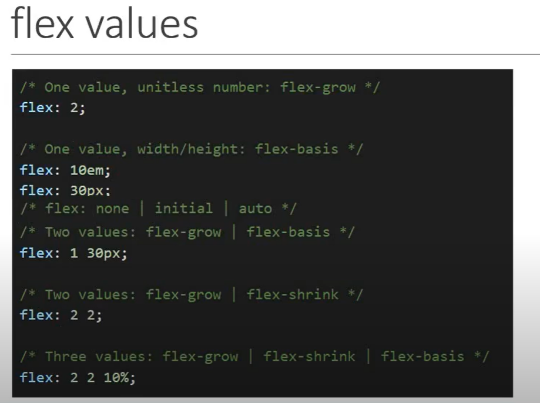

## lecture 17 align self

`align-self` property is used to control the alignment of individual flex item. it is pretty much the same as `align-item` property on the `flex-container`.
To help with the demo increase the height of the container to 400px. so you see that the item stretch from `cross start` to `cross end`.

1. The first possible value for the `flex item` is `align-self: flex-start`
2. second is `align-self: flex-end`
3. `align-self: center`

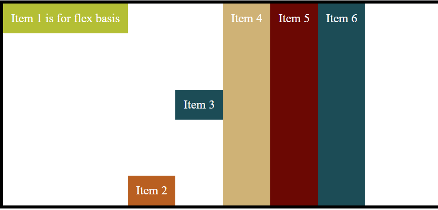

4. The fourth value is `align-self: stretch` now this stretch is from `cross start` to `cross end`.
5. if you see other items all are stretch. you may think `stretch` is the default value. That is not true. the default value for `align-self` is `auto`. which implies that `align-self` property must be computed from the `align-items` property of the parent flex container. items 5 to item 7 are stretched because the parent flex container has a default value of `align-items: stretch`

so if set the flex container with `align-items: flex-start`. The flex-items `align-self` will inherit that from `align-items` of parent.

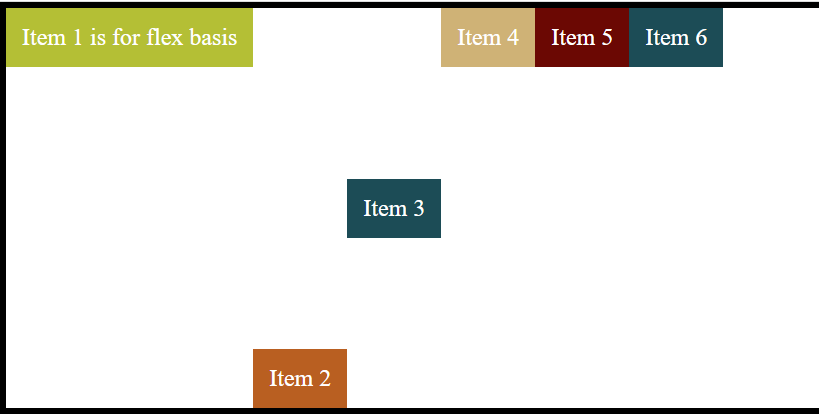

Than if `align-self` is specified it will overrides the parent `align-items` value.

so in short

- align-self align the items individually
- accepts values like auto, flex-start, flex-end, center and stretch
- overrides the align-items value of the flex container.

## lecture 18 Use cases

- Navbar
- Centering item
- unequal height columns and card footers
- Holy Grail layout

## lecture 19 Responsive Navbar

the `index.html` page will look like

```
<!DOCTYPE html>
<html lang="en">
<head>
  <meta charset="UTF-8">
  <meta http-equiv="X-UA-Compatible" content="IE=edge">
  <meta name="viewport" content="width=device-width, initial-scale=1.0">
  <title>Document</title>
  <link rel="stylesheet" href="styles.css">
</head>
<body>
  <nav>
    <ul>
      <li>Home</li>
      <li>About</li>
      <li>Services</li>
      <li>Contact</li>
    </ul>
  </nav>
</body>
</html>
```

the `styles.css` is like below

```
/* lecture 19 Responsive Navbar */

nav {
  font-size: 2rem;
  background-color: #f1f1f1;
  border: 2px solid black;
}

nav ul{
  list-style-type: none;
  margin: 0;
  padding: 0;
  display: flex;
  /* justify-content: space-around; it will not take the whole space so we use flex: auto and text-align: center below*/
}
nav ul li {
  cursor: pointer;
  padding: 0.5rem;
  border: 2px solid black;
  flex: auto;
  text-align: center;
}
nav ul li:hover{
  background-color: #555;
  color: white;
}

@media all and (max-width: 400px){
  nav ul{
    flex-direction: column;
  }
  nav ul li{
    text-align: center;
  }
}
```

so in the style if you notice we took `ul` as the `flex container` and the 4 lis as `flex items`. so we can either use `justify-content: space-around` on the `flex-container` in addition to `display:flex`. but the items will not take the full available space.

if we want the `flex-items` to take the full spac available so on items i.e on lis specify `flex: auto` which means `flex: 0 1 auto` by default.

we can also apply media query that if the max width is less than 400px the `flex-direction` must change to `column` for the `flex-container`

## lecture 20 Centering an Item in a container

in html we have a container and an item as below.

```
<!-- lecture 20 centering an item -->
<!DOCTYPE html>
<html lang="en">
<head>
  <meta charset="UTF-8">
  <meta http-equiv="X-UA-Compatible" content="IE=edge">
  <meta name="viewport" content="width=device-width, initial-scale=1.0">
  <title>Document</title>
  <link rel="stylesheet" href="styles.css">
</head>
<body>
<div class="container">
  <div class="item">
    Item
  </div>
</div>
</body>
</html>
```

in the `styles.css` we have

```
.container{
  border: 5px solid black;
  height: 800px;
  width: 800px;
}
.item{
  height: 200px;
  width: 200px;
  border: 3px solid orange;
}
```

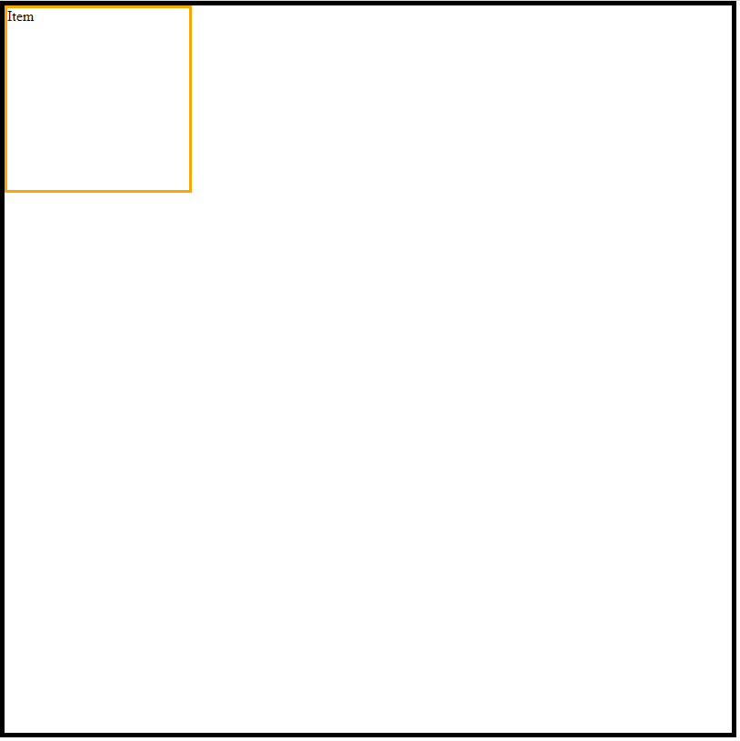

if we want to center the orange item square we add this to the flex-container

```
display: flex;
justify-content: center;
align-items: center;
```

so it becomes

```
/* lecture 20 Centering an item */
.container{
  border: 5px solid black;
  height: 800px;
  width: 800px;
  display: flex;
  justify-content: center;
  align-items: center;
}
.item{
  height: 200px;
  width: 200px;
  border: 3px solid orange;
}
```

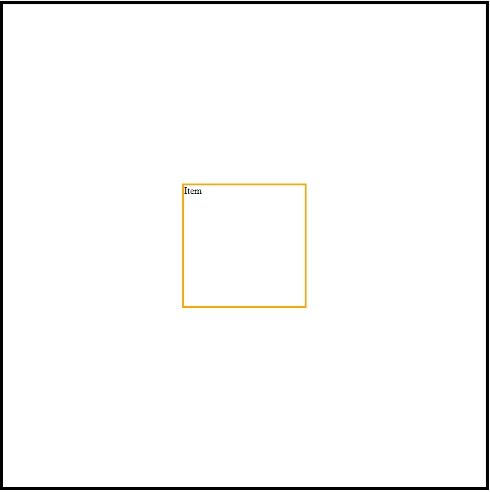
